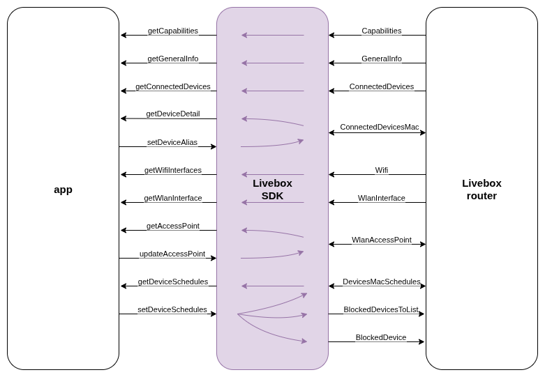

# Livebox Kotlin SDK

The **Livebox Kotlin SDK** is a SDK designed to interact with the Livebox family of routers through their API, using Kotlin programming language. It allows authentication, connected devices management, Wi-Fi configuration, parental controls and more, and features automatic fetching of capabilities for compatibility with this family of routers.
The schematics for the SDK are as follows:


## Initialization
Initialization of the SDK is performed through the `LiveboxSdkBuilder`, which returns the `LiveboxSdk` object to interact with the router. This `LiveboxSdk` object will be the one to use for all other following operations.
```kotlin
val liveboxSdk = LiveboxSdkBuilder()
    .withContext(context = context)
    .withEnvironment(environment = environment)
    .build()
```

### Parameters
- `context`: `Context` — The current context where the initialization is set.
- `environment`: `Environment` — Defines whether to use the test or live API environment (`Environment.TEST` or `Environment.LIVE`).

### Clear traffic permission
For setting-up the module on an Android project, clear traffic should be permited for the app, as Livebox routers do comunicate through non-secure `http`. For doing this, the `cleartextTrafficPermitted` flag must be set to `true`, which can be done on an `network-security-config.xml` as follows:
```xml
<?xml version="1.0" encoding="utf-8"?>
<network-security-config>
    <base-config
        cleartextTrafficPermitted="true" />
</network-security-config>
```
Then this would be referenced in the `application` level in the `AndroidManifest.xml`:
```xml
<?xml version="1.0" encoding="utf-8"?>
<manifest>
    <application
        ...
        android:networkSecurityConfig="@xml/network_security_config">
        ...
    </application>
</manifest>
```

## Authentication
```kotlin
login(username: String? = null, password: String): Boolean
```
Attempts to log in using credentials. If invalid credentials are provided (HTTP 401), they are cleared and it returns `false`. Otherwise, capabilities are fetched and it returns `true`. `username` param is nullable, an in case it's not set, the default "UsrAdmin" value will be used.

## Capabilities
```kotlin
getCapabilities()
```
Fetches and caches the device capabilities (automatically invoked during `login()`).
It includes all features available for the given router. Note that those can change between versions. Additional to the ID, it returns the URI for the given feature, and the operations it allows.

## General Information
```kotlin
getGeneralInfo()
```
Retrieves general information about the device.

## Connected Devices
```kotlin
getConnectedDevices()
```
Returns a list of all currently connected devices.

```kotlin
getDeviceDetail(mac: String)
```
Retrieves details for a specific device identified by its MAC address.

```kotlin
setDeviceAlias(mac: String, alias: String)
```
Sets a custom alias for a connected device given its MAC address.

## Wi-Fi Configuration

```kotlin
getWifiInterfaces()
```
Fetches a list of available Wi-Fi interfaces.

```kotlin
getWlanInterface(wlanIfc: String)
```
Fetches details of a specific WLAN interface.

```kotlin
getAccessPoint(wlanIfc: String, wlanAp: String)
```
Retrieves configuration details for a specific access point.

```kotlin
updateAccessPoint(wlanIfc: String, wlanAp: String, accessPoint: AccessPoint)
```
Updates the configuration for a specific Wi-Fi access point. Used for changing the Wi-Fi's password.

## Parental Controls (Blocked Devices)
```kotlin
getBlockedDevices()
```
Returns a list of devices with blocking conditions (schedules, URLs).

```kotlin
getBlockedDevice(mac: String)
```
Gets detailed information about a device and its blocking conditions given its MAC address.

```kotlin
getDeviceSchedules(mac: String)
```
Retrieves the time-based blocking schedule for a device.

```kotlin
setDeviceSchedules(mac: String, schedules: List<WeekDayHour>)
```
Sets blocking schedules for a specific device.
If the device is not already in the blocked list, it is added first. Then, its status is set to `ENABLED` with a `SCHEDULE` mode, and the new schedule is posted.

## Minimum Requirements
Android 7.0 (API level 24)